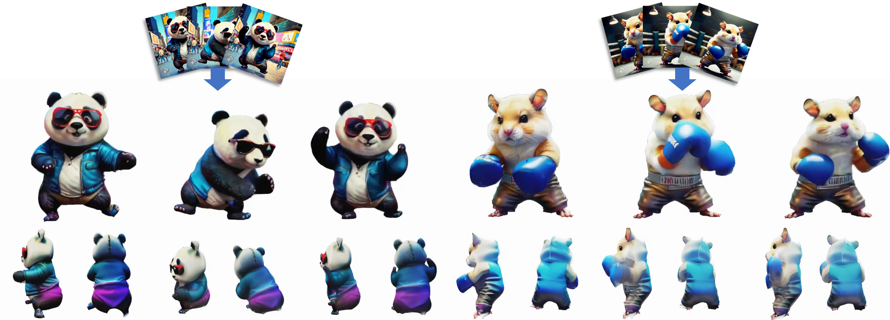

## L4GM: Large 4D Gaussian Reconstruction Model
<p align="center">
    
</p>

[**Paper**](https://arxiv.org/abs/2406.10324) | [**Project Page**](https://research.nvidia.com/labs/toronto-ai/l4gm/) | [**Model Weights**](https://huggingface.co/jiawei011/L4GM) | [**Gradio Demo**](https://huggingface.co/spaces/fffiloni/L4GM-demo)

We present L4GM, the first 4D Large Reconstruction Model that produces animated objects from a single-view video input -- in a single feed-forward pass that takes only a second.

---

### News
- 2024.Dec.20: We thank [@fffiloni](https://huggingface.co/fffiloni) for hosting the Gradio demo! <a href="https://huggingface.co/spaces/fffiloni/L4GM-demo"></a>

### Install
```bash
conda env create -f environment.yml
conda activate l4gm
```

### Inference
Download pretrained [L4GM model](https://huggingface.co/jiawei011/L4GM/blob/main/recon.safetensors) and [4D interpolation model](https://huggingface.co/jiawei011/L4GM/blob/main/interp.safetensors) to `pretrained/recon.safetensors` and `pretrained/interp.safetensors` respectively.

Select an input video. Remove its background and crop it to 256x256 with third-party tools. We provide some processed examples in the `data_test` folder.

1. Generate 3D by:
```sh
python infer_3d.py big --workspace results --resume pretrained/recon.safetensors --num_frames 1 --test_path data_test/otter-on-surfboard_fg.mp4
```

2. Generate 4D by:
```sh
python infer_4d.py big --workspace results --resume pretrained/recon.safetensors --interpresume pretrained/interp.safetensors --num_frames 16 --test_path data_test/otter-on-surfboard_fg.mp4
```

### Training
Render Objaverse with Blender scripts in the `blender_scripts` folder first.

You may render only our filtered subset here [google drive](https://drive.google.com/file/d/16lZ_lEV6BgrP9vwTJznG91iDjbWkMcTz/view?usp=sharing).

Download pretrained [LGM](https://huggingface.co/ashawkey/LGM/blob/main/model_fixrot.safetensors) to `pretrained/model_fixrot.safetensors`.

L4GM model training:
```sh
accelerate launch \
    --config_file acc_configs/gpu8.yaml \
    main.py big \
    --workspace workspace_recon \
    --resume pretrained/model_fixrot.safetensors \
    --data_mode 4d \
    --num_epochs 200 \
    --prob_cam_jitter 0 \
    --datalist data_train/datalist_8fps.txt \
```
Our released checkpoint uses `--num_epochs 500`.

4D Interpolation model training:
```sh
accelerate launch \
    --config_file acc_configs/gpu8.yaml \
    main.py big \
    --workspace workspace_interp \
    --resume workspace_recon/model.safetensors \
    --data_mode 4d_interp \
    --num_frames 4 \
    --num_epochs 200 \
    --prob_cam_jitter 0 \
    --prob_grid_distortion 0 \
    --datalist data_train/datalist_24fps.txt \
```

### Citation
```bib
@inproceedings{ren2024l4gm,
    title={L4GM: Large 4D Gaussian Reconstruction Model}, 
    author={Jiawei Ren and Kevin Xie and Ashkan Mirzaei and Hanxue Liang and Xiaohui Zeng and Karsten Kreis and Ziwei Liu and Antonio Torralba and Sanja Fidler and Seung Wook Kim and Huan Ling},
    booktitle={Proceedings of Neural Information Processing Systems(NeurIPS)},
    month = {Dec},
    year={2024}
}
```
